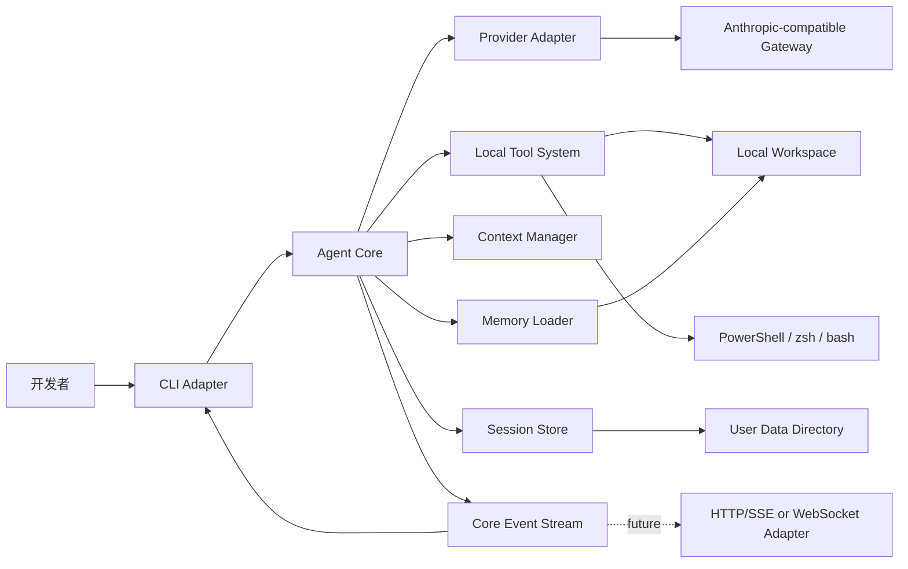
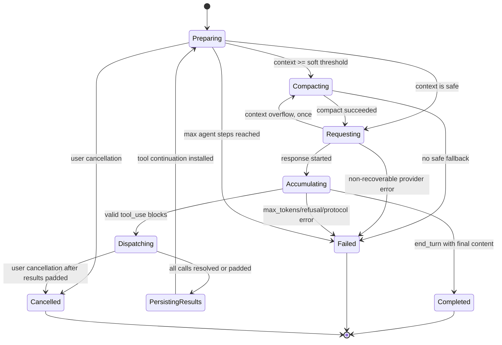

# codingAgent 架构文档

## 1. 架构目标

codingAgent 采用本地优先、事件驱动、协议隔离的分层架构。系统必须做到：

1. Agent 核心不依赖 CLI 或未来前端。
2. Anthropic SDK 类型不进入核心领域模型。
3. 工具定义、策略和执行不写进主循环的条件分支。
4. 原始会话记录与发送给模型的有效上下文分离。
5. 协议配对、压缩边界和恢复一致性由数据结构保证。
6. Windows 与 macOS 的平台差异限制在适配器内部。
7. 每个模块可通过 Fake、临时目录或事件重放独立测试。

## 2. 系统边界



外部模型只接收由 Provider Adapter 构造的请求。所有文件和 Shell 操作均在本地执行。项目不调用服务端代码执行、文件管理或托管 Agent 循环。

## 3. 分层与依赖方向

```text
cli ───────────────┐
future_frontend ───┼──> application/core
                   │        │
                   │        ├──> domain models
                   │        ├──> provider port
                   │        ├──> tool dispatcher port
                   │        ├──> context port
                   │        └──> session port
                   │
providers ─────────┤ implements provider port
tools ─────────────┤ implements tool ports
context ───────────┤ implements context port
sessions ──────────┤ implements session port
memory ────────────┘ supplies instruction snapshots
```

依赖规则：

- `core` 可以依赖领域接口和领域模型，但不能依赖 `cli`、Rich、Typer 或 prompt_toolkit。
- `providers` 可以依赖 Anthropic SDK，但 SDK 对象必须在边界处转换。
- `tools` 不能直接调用 Provider。
- `sessions` 不决定压缩策略，只保存事件和 checkpoint。
- `context` 不直接渲染 UI，只发布上下文事件。
- `cli` 不读取私有 Provider 配置的敏感字段，只接收已脱敏视图。

## 4. 模块划分

### 4.1 CLI Adapter

职责：

- 解析启动参数与 Slash 命令；
- 收集用户输入；
- 消费核心事件并渲染；
- 把取消、模型切换和压缩请求发送给 Application Service。

不负责：协议解析、工具执行、压缩、会话写入和权限判定。

### 4.2 Application/Core

核心组件：

- `AgentApplication`：启动、恢复、切换会话及执行用户命令的门面；
- `AgentLoop`：单个用户任务的循环状态机；
- `Conversation`：有效对话结构和协议不变量；
- `EventBus`：向 CLI/未来前端发布事件；
- `CancellationScope`：统一模型请求与工具调用取消。

### 4.3 Provider Adapter

职责：

- 从脱敏后的 Provider 运行配置建立客户端；
- 将内部 Request 转换为 Anthropic Messages 请求；
- 将 SDK 流事件转换为内部 `ProviderEvent`；
- 完整保存原始内容块；
- 对 HTTP、限流、上下文超限和协议错误分类；
- 实现有限、可观测的重试。

### 4.4 Tool System

组件：

- `ToolCatalog`：从一个或多个 `ToolSource` 收集工具、检测命名冲突并导出 schema；MVP 只注册 `BuiltinToolSource`；
- `ToolRouter`：按名称查找工具并使用 Pydantic 校验参数；
- `ToolDispatcher`：策略判断、未来审批、串行准入、执行、取消及事件通知；
- `ToolHandler`：具体工具实现；
- `ToolResultEncoder`：转换为内部结果和 Anthropic `tool_result`。

### 4.5 Context Manager

组件：

- `TokenEstimator`：请求前估算与 usage 校准；
- `ContextBudget`：模型窗口、输出预留、软阈值和硬阈值；
- `CompactionPlanner`：选择可压缩范围与保留尾部；
- `SummarizingCompactor`：调用当前 Provider 生成结构化摘要；
- `TruncatingCompactor`：与模型摘要相互独立的确定性兜底，产物必须单独校验和持久化；
- `ContextProjector`：从原始历史生成当前有效请求上下文。

### 4.6 Session Store

组件：

- `SessionWriter`：单写者追加 JSONL；
- `SessionReader`：容错读取和事件重放；
- `SessionCatalog`：按项目查找最近会话；
- `CheckpointProjector`：定位最新有效压缩点；
- `Redactor`：持久化前脱敏。

### 4.7 Memory Loader

职责：

- 识别项目根；
- 从项目根到 cwd 加载 `CODING_AGENT.md`；
- 按路径顺序拼接并标记来源；
- 生成内容摘要，用于检测变化；
- 在每个新用户轮次前刷新。

记忆是指令输入，不是会话存储，也不是向量数据库。

## 5. 核心领域模型

### 5.1 Provider 与模型

```python
ProviderProfile
  id: ProviderId
  protocol: "anthropic-messages"
  private_endpoint_ref: str
  auth: AuthConfig
  models: dict[ModelId, ModelCapabilities]

ModelCapabilities
  context_window: int
  max_output_tokens: int
  supports_tools: bool
  thinking_mode: disabled | enabled_budget | effort
  extra_request_options: dict
```

核心只接触 `ProviderId`、`ModelId` 和脱敏能力视图，不接触真实 Base URL 或 API key。

### 5.2 内容块

```text
ContentBlock =
    TextBlock
  | ThinkingBlock
  | RedactedThinkingBlock
  | ToolUseBlock
  | UnknownProviderBlock
```

`ThinkingBlock`、`RedactedThinkingBlock` 和 `ToolUseBlock` 必须保留 Provider 返回的原始字段。未知块不能无声丢弃：持久化原始表示，并由能力策略决定是否允许继续。

### 5.3 Exchange

消息裁剪的最小原子单位不是单条内容块，而是完整 Exchange：

```text
UserExchange
  user content

AssistantExchange
  ordered content blocks
  stop_reason
  usage

ToolContinuationExchange
  assistant exchange containing one or more tool_use blocks
  immediately-following user message containing all matching tool_result blocks
```

不变量：

1. 每个 `tool_use.id` 恰好对应一个 `tool_result.tool_use_id`。
2. `tool_result` 必须紧随产生它的 assistant 消息。
3. tool-result user 消息中所有 `tool_result` 块位于普通文本之前。
4. thinking 工具轮次中的原始 thinking/redacted-thinking 块不得修改或重排。
5. 压缩、截断、恢复和模型切换不得产生半个 `ToolContinuationExchange`。

### 5.4 工具结果

```python
ToolExecutionResult
  call_id: str
  tool_name: str
  status: success | error | denied | cancelled | timeout
  model_content: str
  metadata: ToolMetadata
  is_error: bool
```

`model_content` 是发送给模型的有界、脱敏内容；`metadata` 包含耗时、退出码、原始字节数和截断状态，但不包含密钥。

## 6. Agent 循环状态机



### 6.1 单轮算法

1. 追加并持久化用户 Exchange。
2. 刷新项目记忆快照。
3. 投影有效上下文并检查预算。
4. 必要时运行压缩事务。
5. 发起 Provider 流请求并持久化聚合后的 assistant Exchange。
6. 若包含 `tool_use`：
   - 逐个校验并串行执行；
   - 未知工具或参数错误生成 `is_error=true` 结果；
   - 用户取消或致命错误时为剩余调用生成未执行结果；
   - 一次性安装包含全部匹配结果的 user Exchange；
   - 继续下一模型请求。
7. 若无工具调用，根据停止原因完成、失败或要求用户继续。
8. 发布最终事件并 flush 会话。

### 6.2 正常与异常终止

- `end_turn` 且不存在工具调用：正常完成。
- `tool_use`：进入工具循环。
- `max_tokens`：保留响应，报告截断；不得把不完整工具输入当作有效调用。
- `refusal`：停止并向用户展示拒绝状态。
- 最大 Agent 步数：保存会话并停止。
- 同一工具和规范化参数连续重复达到阈值：注入一次无进展提示；再次重复则停止并报告 blocker。
- 用户取消：终止当前活动，补齐协议结果并保存。

停止原因由 Provider Adapter 归一化，AgentLoop 不比较百炼私有字符串。

## 7. Provider 流聚合

### 7.1 聚合规则

- 以 `content_block_start.index` 建立 slot。
- `text_delta` 追加到 TextBlock。
- thinking delta 与 signature delta 分别累积到原始 ThinkingBlock。
- `input_json_delta.partial_json` 只做字符串追加。
- 到 `content_block_stop` 后才解析工具 JSON。
- `message_delta` 更新 usage 与 stop reason。
- 到 `message_stop` 后验证所有 slot 完整性并构造 AssistantExchange。

### 7.2 协议错误

以下情况不得通过伪造数据修复：

- `tool_use` 缺少 ID；
- 内容块缺少类型或结束事件；
- 工具 JSON 在 block stop 后仍不合法；
- thinking 签名或 redacted-thinking 必要字段缺失；
- stream 在工具块中间断开。

处理方式为丢弃未安装的 assistant Exchange，记录脱敏协议错误，并按 Provider 策略有限重试。只有完整响应才能进入对话历史，因此重试不会重复执行本地工具。

## 8. 工具架构

### 8.1 ToolSource 与 Tool 接口

```python
class ToolSource(Protocol):
    source_id: str

    async def list_tools(self) -> Sequence[Tool]: ...
```

`ToolCatalog` 只依赖 `ToolSource`，对 AgentLoop 和 ToolDispatcher 提供统一的查找与 schema 导出接口。MVP 的 `BuiltinToolSource` 包含项目内置工具；未来的 `McpToolSource` 将外部 MCP Server 的工具转换为同一 `Tool` 契约。该边界不引入 MCP 依赖、守护进程或网络端口。

外部工具未来使用 `mcp__<server>__<tool>` 命名空间，但仍必须经过 ToolDispatcher，不允许绕过策略、审批、取消、脱敏和会话记录。

Tool 接口为：

```python
class Tool(Protocol):
    name: str
    description: str
    input_model: type[BaseModel]
    risk: ToolRisk
    supports_parallel: bool

    async def execute(self, args, context) -> ToolExecutionResult: ...
```

首版所有工具 `supports_parallel=False`。字段保留用于未来扩展，但 Dispatcher 不实现并发调度。

### 8.2 Dispatcher 流程

```text
lookup tool
  -> validate arguments
  -> evaluate policy
  -> emit ToolStarted
  -> execute with cancellation and limits
  -> sanitize and truncate result
  -> emit ToolFinished/ToolFailed/ToolCancelled
  -> return ToolExecutionResult
```

未来审批通过 `ApprovalPort` 接入 Dispatcher。CLI 只是 `ApprovalPort` 的一种实现，不拥有审批策略。

### 8.3 错误分类

```text
RecoverableToolError
  参数不合法、文件不存在、内容冲突、非零退出码、超时、拒绝
  -> is_error=true 返回模型

FatalToolError
  存储不可用、核心不变量损坏、无法安全构造配对结果
  -> 补齐剩余 tool_result 后终止当前任务

InternalToolBug
  未预期异常
  -> 完整 traceback 写入脱敏开发日志；模型只收到通用错误
```

## 9. 文件安全与编辑一致性

### 9.1 WorkspaceGuard

所有文件工具共用 `WorkspaceGuard`：

1. 解析工作区根和请求路径；
2. 展开 `..` 与符号链接；
3. 使用平台正确的路径比较判断包含关系；
4. 应用读/写保护规则；
5. 返回经过验证的 `ResolvedWorkspacePath` 值对象。

ToolHandler 不接受未经验证的裸路径。

### 9.2 ReadSet

Session 维护结构化 ReadSet：

```text
absolute path -> SHA-256, size, mtime_ns, read_at, visible_ranges
```

`edit_file` 和覆盖已有文件的 `write_file` 必须检查 ReadSet。ReadSet 是运行状态和压缩 checkpoint 的一部分，不依赖模型从历史中记忆。

### 9.3 原子写入

- 新内容先写入同目录临时文件；
- flush 后使用平台支持的原子替换；
- 替换前再次验证文件版本；
- 失败时清理临时文件并保留原文件；
- 换行风格和末尾换行默认跟随原文件。

## 10. Shell 架构

```text
ShellTool
  -> ShellPolicy
  -> ShellBackendFactory
       -> WindowsPowerShellBackend
       -> PosixShellBackend
  -> ProcessOutputCollector
  -> ProcessTerminator
```

`ShellPolicy` 负责 cwd、超时上限、环境变量和风险元数据；backend 负责平台参数、启动和退出；`ProcessTerminator` 负责逐级取消。危险命令识别只能提升风险或触发未来审批，不能代替 OS 沙箱。

首版 Shell 默认自动执行，但每次调用都经过 `ShellPolicy`，以保证未来切换 `ask/deny` 时不需要重写工具。

## 11. 上下文投影与压缩

### 11.1 上下文组成

```text
system instructions
tool schemas
current project memory snapshot
latest compaction summary/checkpoint
complete exchanges after checkpoint
current user task tail
```

原始 JSONL 不因压缩改变。`ContextProjector` 每次请求重新生成有效上下文。

### 11.2 压缩事务

```mermaid
sequenceDiagram
    participant Loop as AgentLoop
    participant Ctx as ContextManager
    participant Store as SessionStore
    participant LLM as Provider

    Loop->>Ctx: compact(reason)
    Ctx->>Store: append CompactionStarted
    Ctx->>Ctx: select complete middle exchanges
    Ctx->>LLM: request structured summary
    alt valid summary
        Ctx->>Store: append CompactionCompleted(checkpoint)
        Store-->>Ctx: durable
        Ctx-->>Loop: install checkpoint
    else summary/provider failure
        Ctx->>Store: append strategy failure
        Ctx->>Ctx: independently build and validate deterministic fallback
        alt fallback valid and durable
            Ctx->>Store: append fallback checkpoint
            Store-->>Ctx: durable
            Ctx-->>Loop: atomically install fallback checkpoint
        else fallback invalid or storage failure
            Ctx-->>Loop: retain original context and warn
        end
    end
```

### 11.3 摘要内容

摘要采用版本化结构：

```text
task_goal
user_constraints
decisions
files_read
files_modified
commands_and_results
verification_status
known_failures
pending_work
```

摘要外仍保留 ReadSet、当前模型、记忆摘要和最近完整 Exchange。摘要为空、格式无效或写盘失败时不得替换当前上下文。

### 11.4 模型切换

切换 Provider/模型时：

1. 原始历史不变；
2. 保存 `ModelChanged` 事件；
3. 从新模型的有效上下文中移除旧模型 thinking/redacted-thinking；
4. 保留文本、工具调用和结果；
5. 如新模型窗口不足，先压缩再发下一请求；
6. UI 标明上下文已为模型切换重新投影。

## 12. 会话事件与恢复

### 12.1 事件信封

```json
{
  "schema_version": 1,
  "event_id": "...",
  "session_id": "...",
  "sequence": 42,
  "timestamp": "...",
  "type": "ToolFinished",
  "payload": {}
}
```

事件类型至少包括：

```text
SessionStarted
UserExchangeAdded
AssistantExchangeAdded
ToolStarted
ToolFinished
ToolCancelled
ToolResultsAdded
UsageRecorded
MemorySnapshotChanged
CompactionStarted
CompactionCompleted
CompactionFailed
ModelChanged
TurnCancelled
TurnFailed
TurnCompleted
SessionClosed
```

### 12.2 恢复算法

1. 容错读取所有完整 JSONL 行。
2. 校验 session ID 和严格递增 sequence。
3. 重放事件，恢复原始历史、有效 checkpoint、ReadSet 和配置引用。
4. 若最后一个 assistant Exchange 含未完成 `tool_use`：
   - 不重新执行原工具；
   - 为每个缺失调用生成 `interrupted_before_result`；
   - 持久化修复事件；
   - 下一轮把修复结果交给模型。
5. 重新加载当前项目记忆和当前 Provider 私有配置。
6. 发布 `SessionResumed` 视图事件。

私有 Base URL 和 API key 从不进入 JSONL，因此恢复依赖当前设备的用户配置。另一台设备缺少相应 Provider 时，会话仍可查看，但不能继续请求，直到配置可用。

## 13. 核心事件接口

UI 可消费事件示例：

```text
AgentStarted
ProviderRequestStarted
TextDelta
ThinkingStarted
ThinkingDelta
ThinkingFinished
ToolCallReady
ToolStarted
ToolOutputDelta
ToolFinished
ContextUsageChanged
CompactionStarted
CompactionFinished
ModelChanged
WarningRaised
AgentCompleted
AgentFailed
AgentCancelled
```

核心事件包含公开、已脱敏的展示数据。原始 Provider 内容块只进入 Conversation 和 Session Store，不通过 UI 事件泄露签名或内部端点。

未来 HTTP/SSE 前端只需把同一事件序列编码为 JSON，不改变 AgentLoop。

## 14. 错误与重试架构

### 14.1 Provider 错误

- 鉴权、配置和不支持参数：不重试；
- 429：尊重 `Retry-After`，有限退避；
- 短暂 5xx/连接失败：仅在 assistant Exchange 尚未安装时有限重试；
- 流中断：丢弃本次未完成响应后有限重试；
- 上下文超限：强制压缩后重试一次；
- 协议内容缺失：记录兼容性错误，不伪造 ID 或 thinking 数据。

模型请求不是业务幂等操作。这里的“可重试”仅表示本地尚未执行该响应中的工具、尚未把不完整响应安装进历史；重试可能产生不同文本并增加费用，必须记录次数。

### 14.2 存储错误

关键事件无法持久化时，不继续执行会改变本地状态的工具。若工具已经完成但结果写盘失败，当前任务进入 Fatal 状态，并明确提示会话可能需要人工检查。

### 14.3 脱敏错误

所有异常在进入 CLI、日志和 JSONL 之前经过 Redactor。Redactor 处理：

- 已配置 API key 的精确值；
- Authorization/x-api-key 等请求头；
- Provider 私有 Base URL；
- 常见密钥格式；
- SDK 异常中携带的请求 URL。

## 15. 安全边界声明

MVP 提供：

- 文件工具工作区路径边界；
- 编辑前版本校验；
- Shell cwd、超时、输出和环境变量限制；
- 敏感配置与日志脱敏；
- 未来审批策略接口。

MVP 不提供：

- 完整 OS 沙箱；
- Shell 对工作区外文件访问的强制系统级阻断；
- 完整网络隔离；
- 对任意危险命令的可靠静态判定。

因此 UI 和文档只能描述实际防护，不能把自动模式宣传为安全沙箱。

## 16. 测试架构

### 16.1 Test Doubles

- `FakeProvider`：按脚本输出 ProviderEvent；
- `InMemorySessionStore`：测试事件和 checkpoint；
- `FakeClock`：控制超时和退避；
- `FakeApprovalPort`：为未来审批提供固定结果；
- 临时 Workspace：执行真实文件工具；
- `FakeShellBackend`：测试 Dispatcher；真实 Shell backend 另做平台集成测试。

### 16.2 不变量测试

重点使用参数化测试和状态机式用例验证：

- 任意提前退出后，已安装的每个 tool_use 都有 tool_result；
- 任意压缩后不存在半个 ToolContinuationExchange；
- 任意模型切换后旧 thinking 不进入有效请求；
- 任意恢复后 sequence、checkpoint 和 ReadSet 一致；
- 任意文件修改只发生在版本校验成功之后。

## 17. 实现顺序与分支依赖

```text
feature/provider ───────┐
feature/sessions ───────┼──> feature/agent-loop
feature/tools-read-search ──┐       │
feature/tools-write-edit ───┼───────┤
feature/shell ──────────────┘       │
feature/memory ─────────────────────┤
                                    v
feature/context ─────────────> feature/cli
```

上图表示模块依赖关系，不表示必须先把底层模块全部实现完毕。实际交付以行走骨架开始，再按纵向切片逐步替换骨架中的 Fake 或最小实现。

推荐顺序：

1. 以失败的端到端测试定义行走骨架：最小 CLI/Application API、FakeProvider、AgentLoop、`read_file` 和内存会话；
2. 让行走骨架通过，并在 Windows/macOS CI 持续运行；
3. 按纵向切片实现 Provider 流聚合、内置工具、JSONL 会话/记忆、上下文压缩和 CLI 完善；
4. 每个切片从验收/契约测试向内推进到单元测试，通过全部 CI 门禁后立即合入 `main`；
5. 最后进行真实 Provider 契约探测和 Windows/macOS 集成加固。

公共领域模型在早期固定后再并行开发。修改 `ContentBlock`、`Exchange`、`CoreEvent` 等公共契约必须先更新架构文档和契约测试，避免不同分支同时改变接口。

## 18. 架构决策摘要

| 决策 | 选择 | 未选择方案 | 主要原因 |
|---|---|---|---|
| 语言 | Python 3.12+ | TypeScript | 交付速度、工具与测试实现效率 |
| Provider | Anthropic Messages 兼容适配器 | OpenAI Chat Completions 作为核心 | 与实际百炼/公司端点一致，thinking/tool block 更明确 |
| Agent 循环 | 自研状态机 | SDK Tool Runner/Agent 框架 | 题目要求且便于验证重要逻辑 |
| UI | Textual 全屏 TUI + stdout 非交互模式 | Web | 满足现代 coding agent 交互体验，同时保留脚本化与稳定事件接口 |
| 工具执行 | MVP 串行 | 自动并行 | 避免写入和命令顺序竞态 |
| 编辑 | 行范围 + 原文 + 文件哈希 | 全文覆写/apply_patch | 精确、可检测冲突、实现规模可控 |
| 持久化 | JSONL 事件日志 | SQLite | 可检查、易恢复、迁移成本低 |
| 压缩 | 本地摘要 + 确定性兜底 | 服务端托管压缩 | 满足题目且可测试 |
| Shell | 平台 backend | 统一 Bash 假设 | Windows/macOS 双平台需求 |
| 安全 | 路径/进程/脱敏 + 审批接口 | 首版 OS 沙箱 | 时间限制与跨平台复杂度 |
| MCP | 仅保留 Client 端 ToolSource 扩展点 | MVP 实现传输或暴露 Server 端口 | 后续可接 CodeGraph/OpenCodeReview，不影响主体交付 |
| 开发顺序 | 薄纵切行走骨架 + 分层 TDD | 纯自顶向/纯自底向 | 早验证主链路，同时保持模块可测 |

## 19. 架构完成标准

- 所有 P0 功能都能映射到明确模块和测试边界；
- Anthropic 内容块 round-trip 不丢字段；
- AgentLoop、CLI、Provider、工具和存储之间不存在反向依赖；
- 会话恢复与上下文压缩保持协议不变量；
- Windows/macOS 差异不泄漏到工具领域接口；
- 未来前端可以只依赖 Application API 与 CoreEvent，不修改 AgentLoop。
